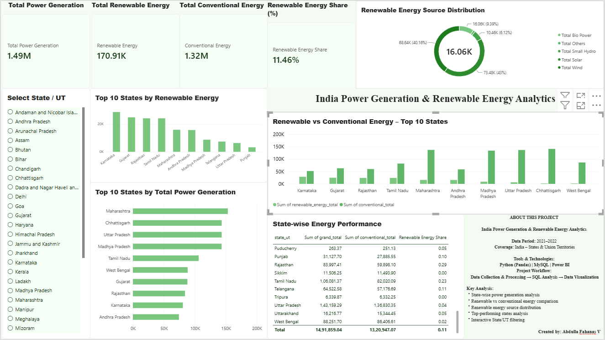

# India Power Generation & Renewable Energy Analytics

## 📊 Project Overview

This project analyzes state-wise power generation in India, with a focus on renewable and conventional energy sources for the **2021–2022** period.

The project demonstrates an end-to-end data analytics workflow using:

**Python (Pandas) → MySQL → Power BI**

The workflow covers data cleaning and preprocessing, SQL-based analysis, comparative energy analysis, and interactive dashboard development.

---

## 📅 Data Period

**2021–2022**

## 📍 Geographic Coverage

**India – States and Union Territories**

---

## 🛠️ Tools & Technologies

- **Python** – Data cleaning and preprocessing
- **Pandas** – Data manipulation and transformation
- **MySQL** – Data storage and SQL analysis
- **Power BI** – Interactive dashboard and data visualization

---

## 🔄 Project Workflow

```text
Raw CSV Dataset
       ↓
Python & Pandas
(Data Cleaning & Transformation)
       ↓
MySQL
(Data Storage & SQL Analysis)
       ↓
Power BI
(Interactive Dashboard & Visualization)


📂 Project Structure
India-Power-Generation-Analytics/
│
├── data/
│   ├── power_generation.csv
│   └── cleaned_power_generation.csv
│
├── python/
│   └── data_processing.py
│
├── sql/
│   └── india_power_analytics.sql
│
├── dashboard/
│   └── India_Power_Generation_Analytics.pbix
│
├── images/
│   └── dashboard_preview.png
│
└── README.md

📈 Key Analysis Performed
Total power generation analysis
Renewable vs conventional energy comparison
Renewable energy share calculation
Top 10 states by total power generation
Top 10 states by renewable energy generation
Solar energy analysis
Wind energy analysis
Bio-power analysis
Small hydro analysis
Renewable energy source distribution
State-wise renewable energy classification
Dominant renewable energy source analysis
🔍 Key Insights
The dataset contains power generation information for 36 States and Union Territories.
Renewable energy contribution was compared with conventional energy generation.
Solar and wind emerged as major renewable energy sources in the dataset.
Renewable energy contribution varies significantly across States and Union Territories.
Different States/UTs show different dominant renewable energy sources.
The Power BI dashboard provides interactive State/UT-level analysis.
📊 Power BI Dashboard


Dashboard Features
Total Power Generation KPI
Total Renewable Energy KPI
Total Conventional Energy KPI
Renewable Energy Share
Top 10 States by Total Power Generation
Top 10 States by Renewable Energy
Renewable vs Conventional Energy Comparison
Renewable Energy Source Distribution
State-wise Energy Performance
Interactive State/UT Filter
💡 Project Highlights

This project demonstrates an end-to-end analytics workflow:

Data Processing → Database Management → SQL Analysis → Business Insights → Data Visualization

It combines technical data analytics skills with an energy and sustainability-focused use case.

👤 Author

Abdulla Fahanas V

Environmental Science & Technology | ESG & Sustainability | Data Analytics
